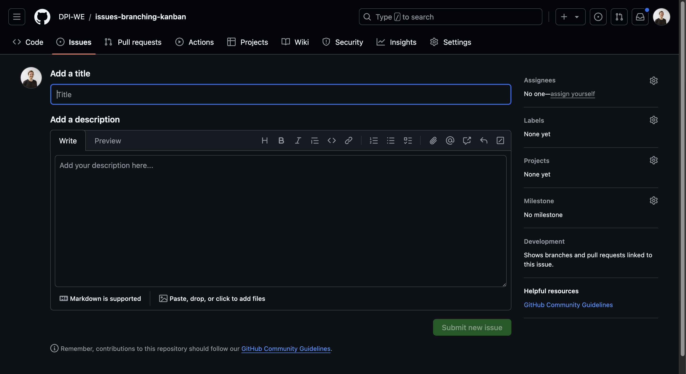
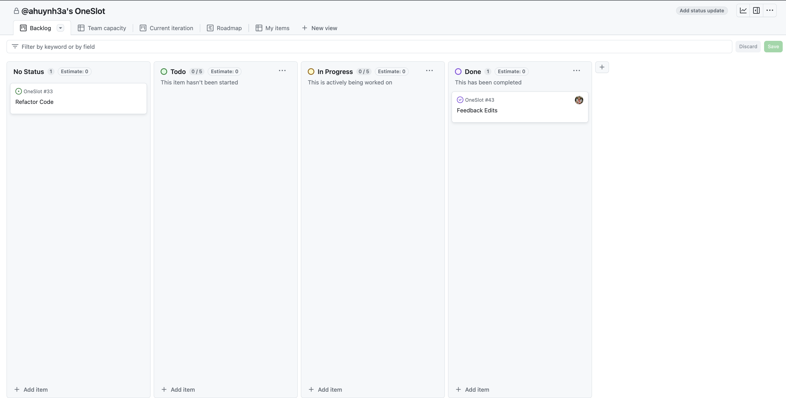
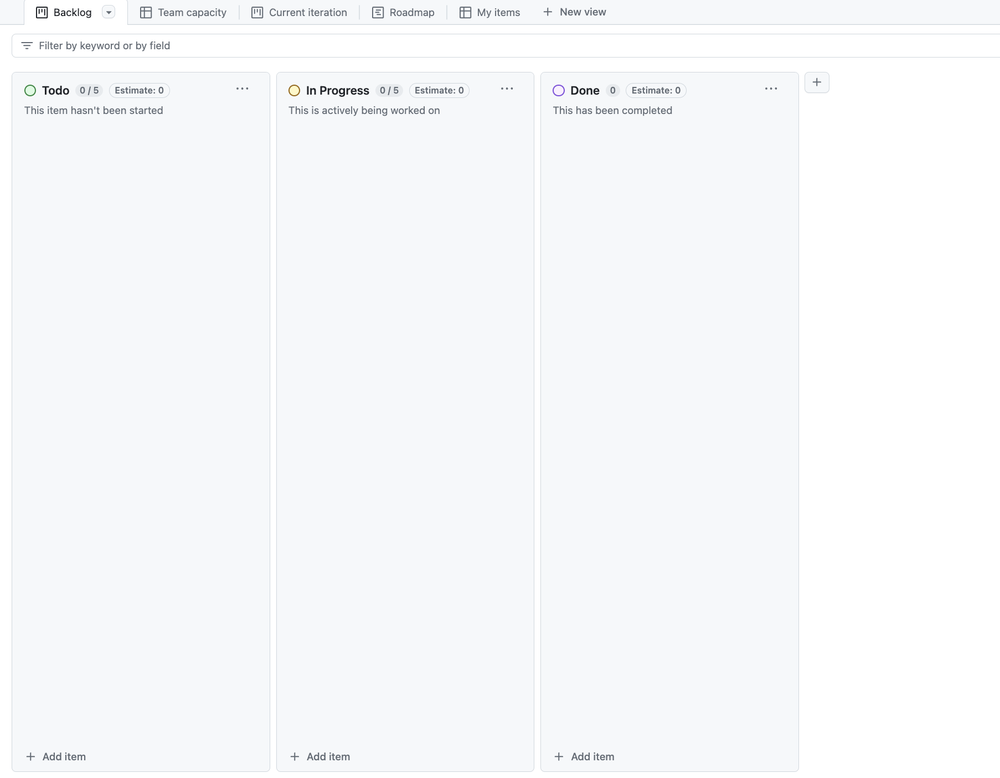
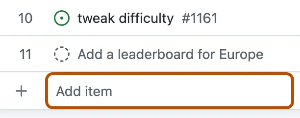

# Mastering GitHub Workflow: Issues, Branches, and Kanban Boards

In this lesson, we will learn how to efficiently manage your development workflow using GitHub features such as Issues, Branches, and Kanban Boards. By the end of this lesson, you'll be able to break tasks into issues, manage development with branches, and visualize progress using GitHub Project Boards.

## Issues: Breaking Down Work

GitHub Issues are a great way to keep track of work that needs to be done. Issues are like tasks or to-do items. Here’s how to use them:

- **Title**: A short description of the task.
- **Description**: A more detailed explanation, including goals, steps, or requirements.
- **Comments**: Team members can discuss the issue and ask questions.
- **Assignment**: You can assign issues to team members to make sure they know who is responsible.
- **Labels**: Categorize issues (e.g., `bug`, `feature`, `enhancement`).
- **Milestones**: Group related issues into a milestone, which represents a bigger goal.

### Quiz: Understanding Issues
- What is the purpose of an issue on GitHub?
- To track a task or bug
  - Correct! Issues are used to track work such as tasks or bugs.
- To store the project code
  - Incorrect. Issues help manage tasks, not store code.
- To create a Kanban board
  - Incorrect. A Kanban board organizes issues but is not created from them directly.
{: .choose_best #github_issues title="Purpose of Issues" points="1" answer="1"}

---

## Branches: Working on Different Versions

Branches allow developers to work on different features, fixes, or experiments simultaneously without affecting the main codebase.

### How Branches Work

1. **Create a Branch**: When you start working on a feature or fix, create a new branch off main. (`git checkout -b my-new-branch`)
2. **Do the Work**: Make changes, add new code, or fix bugs on your branch.
3. **Merge Back**: Once the work is done, you can merge the branch back into the main branch. (Usually by making a pull request and getting a code review)

### Branch Naming Conventions

Good branch names make it clear what the branch is for:

- **Example 1**: `23-jd-setup-dev-environment` (Issue #23, by JD, for setting up the development environment).
- **Example 2**: `feature/user-authentication` (Working on a user authentication feature).

It's a good practice to follow established branch naming conventions outlined in the README contribution section.

### Quiz: Naming Branches
- Which of the following is a good branch name for fixing a login bug?
- `fix-login-issue`
  - Correct! This branch name clearly explains the task.
- `branch-one`
  - Incorrect. This name is too vague.
- `update`
  - Incorrect. This is not specific enough.
{: .choose_best #branch_names title="Good Branch Names" points="1" answer="1"}

---

## Kanban Boards: Visualizing Workflow

Kanban boards help teams manage tasks by showing them in different stages, such as "To Do", "In Progress", and "Done". In GitHub, these boards are available through **GitHub Project Boards**.

### Benefits of Kanban Boards:
1. **Visualization**: Clearly see tasks and their progress.
2. **Work Organization**: Organize work in stages and limit work in progress (WIP).
3. **Collaboration**: Everyone can easily see what’s happening in the project.
4. **Prioritization**: Helps to focus on important tasks by prioritizing them.

---

## GitHub Project Boards

GitHub Project Boards allow you to manage issues and pull requests in a visual way.

### Creating a Project Board

1. Navigate to the repository's **Projects** tab.
2. Click **New Project**, choose a template (e.g., **Kanban**), and give your project a name.

### Adding Columns

- Click **+** to add columns like "To Do", "In Progress", and "Done".

### Adding Issues and Pull Requests

- You can add existing issues and pull requests to the board by clicking **+ Add item** or by linking them directly from the issue or pull request page.

### Quiz: Kanban Benefits
- Which of the following is a key benefit of using Kanban boards?
- Limiting work in progress (WIP)
  - Correct! Kanban boards help focus on completing tasks before starting new ones.
- Writing code
  - Incorrect. Kanban boards help manage tasks, not write code.
{: .choose_best #kanban_benefits_quiz title="Kanban Board Benefits" points="1" answer="1"}

---

## Practical Example: Using GitHub Project Boards

Let's go through an example of setting up a project board, adding issues, and tracking progress.

1. **Create a Project Board**: Go to your repository, click the **Projects** tab, and create a **Kanban** project called "Development Workflow".
2. **Add Columns**: You will see default columns like "To do", "In progress", and "Done". You can also add more columns if needed.
3. **Create and Link Issues**: Create an issue (e.g., "Set up dev environment") and link it to your project.
4. **Move Issues**: As you work, move the issue across columns based on its status.

---

## Linking Pull Requests to a Project Board

Just like issues, you can also link pull requests to a project board. This helps track code changes alongside task progress.

1. **Link from Pull Request**: On the right side of a pull request, you’ll find the **Projects** section where you can link the pull request to the board.
2. **Move Across Columns**: As the pull request moves through stages (e.g., in review, merged), update its position on the board.

- Can you link both issues and pull requests to a GitHub Project Board?
- Yes
  - Correct! Both issues and pull requests can be linked to a GitHub Project Board.
- No
  - Incorrect. GitHub allows linking both issues and pull requests.
{: .choose_best #linking_pull_requests_quiz title="Linking Pull Requests to Project Board" points="1" answer="1"}

---

## Submit Your Pull Requests

To practice submitting pull requests, follow the instructions in these repositories:

### Link In Bio Pull Request

Follow the contribution guidelines for the [Link In Bio](https://github.com/DPI-WE/link-in-bio) repository.

- Enter your `https://github.com/DPI-WE/link-in-bio` pull request URL:
- `https://github.com/DPI-WE/link-in-bio/pull`
  - Great job!
- any
  - Not quite. Make sure the URL looks like: `https://github.com/DPI-WE/link-in-bio/pull/<id>`
{: .free_text #link_in_bio_pull_request_url title="Link in Bio Pull Request URL" points="1" answer="1" }

After you submit the Pull Request URL here, return to Canvas and submit the URL again in the assignment "Pull Request URL for Link in Bio".

An instructor will provide additional feedback on your submission there.

### First Project Pull Request

Follow the contribution guidelines for the [First Project](https://github.com/DPI-WE/first-project) repository.

- Enter your `https://github.com/DPI-WE/first-project` pull request URL:
- `https://github.com/DPI-WE/first-project/pull`
  - Great job!
- any
  - Not quite. Make sure the URL looks like: `https://github.com/DPI-WE/first-project/pull/<id>`
{: .free_text #first_project_pull_request_url title="First Project Pull Request URL" points="1" answer="1" }

After you submit the Pull Request URL here, return to Canvas and submit the URL again in the assignment "Pull Request URL for First Project".

An instructor will provide additional feedback on your submission there.

### Request to Meme Pull Request

Follow the contribution guidelines for the [Request to Meme](https://github.com/DPI-WE/request-to-meme) repository.

- Enter your `https://github.com/DPI-WE/request-to-meme` pull request URL:
- `https://github.com/DPI-WE/request-to-meme/pull`
  - Great job!
- any
  - Not quite. Make sure the URL looks like: `https://github.com/DPI-WE/request-to-meme/pull/<id>`
{: .free_text #request_to_meme_pull_request_url title="Request to Meme Pull Request URL" points="1" answer="1" }

After you submit the Pull Request URL here, return to Canvas and submit the URL again in the assignment "Pull Request URL for Request to Meme".

An instructor will provide additional feedback on your submission there.

---

## Conclusion

By mastering GitHub Issues, Branches, and Project Boards, you can streamline your workflow, organize your tasks, and ensure everyone on your team is aligned. Practice these skills by setting up your own boards and linking issues and pull requests to them.

---

- Approximately how long (in minutes) did this lesson take you to complete?
{: .free_text_number #time_taken title="Time taken" points="1" answer="any"}
